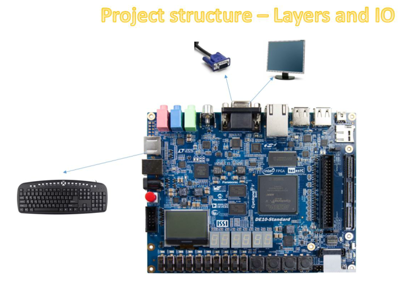
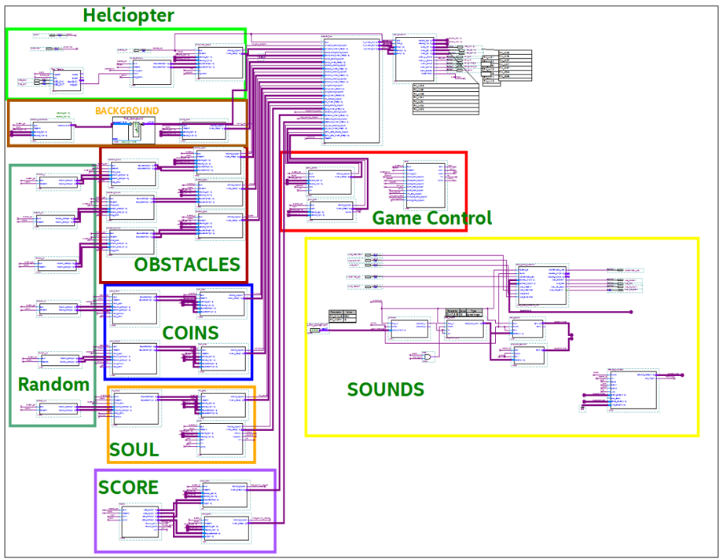

# Helicopter-Game-VHDL
Final project in EE Lab which focuses on using VHDL to design a game platform using Intel’s DE10 FPGA. (Working Environment: Quartus Prime).

Youtube Link:
[Helicopter Game Video](https://youtu.be/18ODwgeK0W8)

Main Components that were used in the Project:

This is the block diagram of the game:

Segmentaiton of the TOP (from Quartus):

