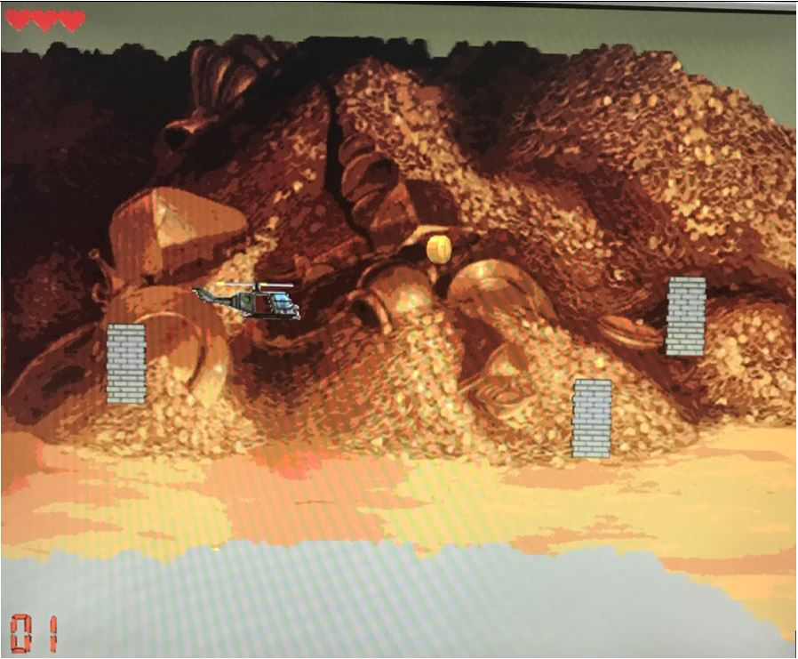
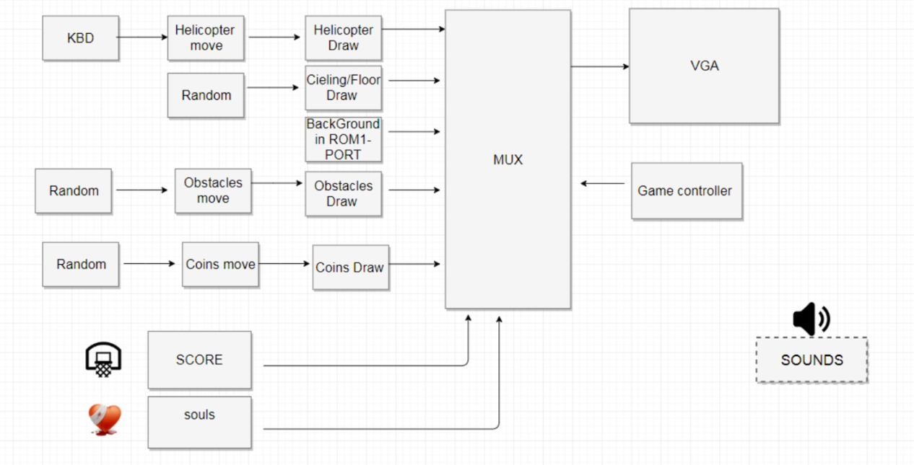
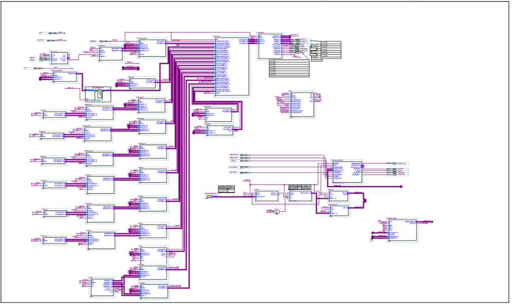

# Helicopter-Game-VHDL
Final project in EE Lab which focuses on using VHDL to design a game platform using Intel’s DE10 FPGA. (Working Environment: Quartus Prime).

Youtube Link:
[Youtube](https://youtu.be/18ODwgeK0W8)

This is the block diagram of the game:

TOP screenshot from Quartus:

